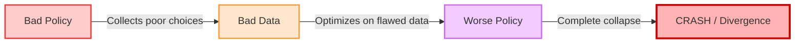
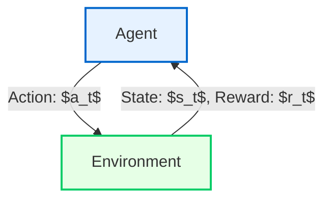
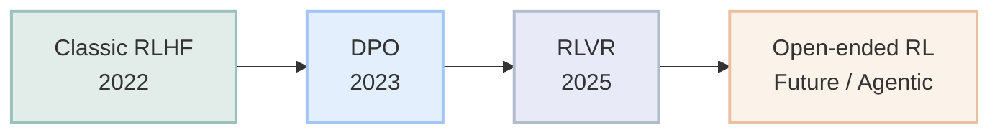
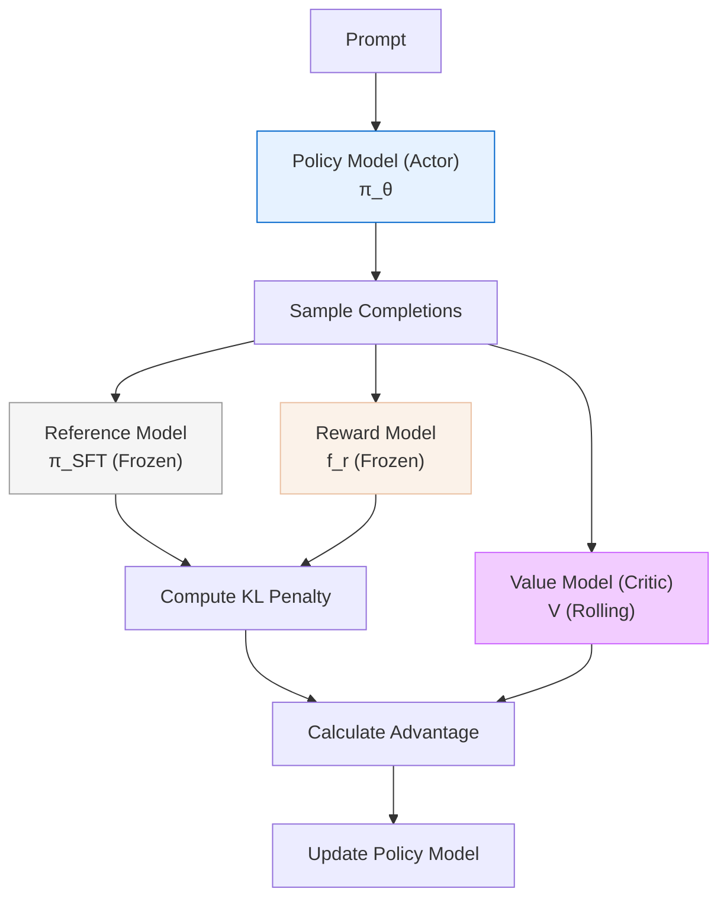
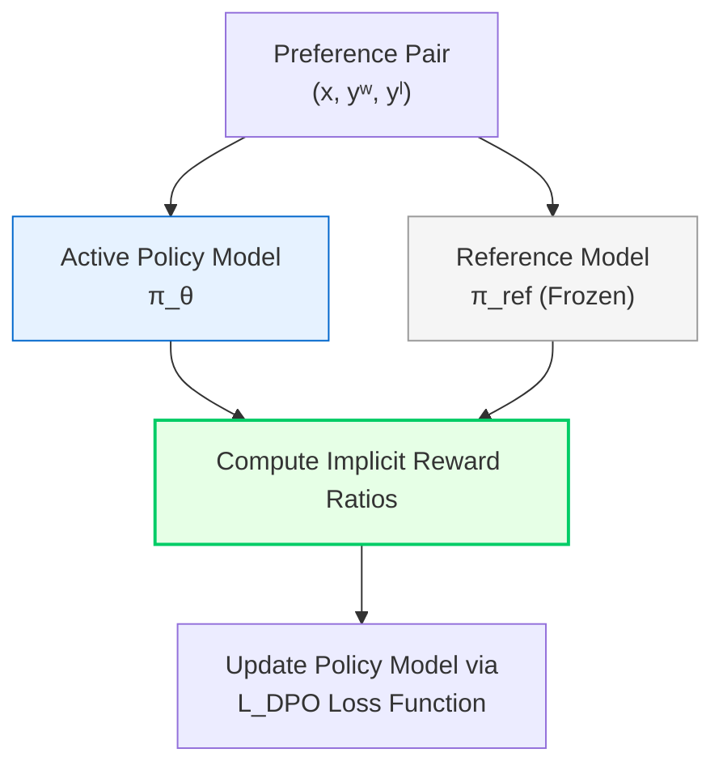

---
tags:
  - machine-learning
  - reinforcement-learning
  - policy-gradient
  - REINFORCE aliases:
  - RL Foundations
  - Policy Gradient Notes created: 2025-05-27
---
---
tags:
  - machine-learning
  - reinforcement-learning
  - policy-gradient
  - REINFORCE
aliases:
  - RL Foundations
  - Policy Gradient Notes
created: 2025-05-27
---

# Reinforcement Learning (RL) Foundations

## Table of Contents

- [[#1. Core Framework & Paradigm Shift]]
- [[#2. Intuition Learning from Trajectories]]
- [[#3. Mathematical Objective Function]]
- [[#4. The REINFORCE Algorithm]]
- [[#5. Core Challenges Why is RL Hard?]]
- [[#6. General Model-Free RL Interaction Framework]]

---

## 1. Core Framework & Paradigm Shift

Reinforcement Learning is a framework for **learning from experience**. An **agent** learns to optimize its behavior via sequential interaction with an **environment** to discover novel solutions — without explicit step-by-step labels.

### Change of Terminology

When moving from Supervised Learning to Reinforcement Learning, the mental mapping changes:

> [!NOTE] Terminology Mapping: SL → RL
> | Supervised Learning | Reinforcement Learning |
> |---|---|
> | Model (Neural Network) | Policy ($\pi_\theta$) |
> | Input ($x$) | State ($s$) |
> | Output ($y$) | Action ($a$) |

---

## 2. Intuition: Learning from Trajectories

### The Workflow Loop

1. Initialize the policy network ($\pi_\theta$) with random weights.
2. Let the policy interact with the environment to collect an **episode** (also called a **trajectory** $\tau$).
3. Apply behavioral reinforcement:
   - 🟢 **Won Games (High Reward):** Increase the probability of selecting those action sequences again.
   - 🔴 **Lost Games (Low/Negative Reward):** Decrease the probability of selecting those action sequences.

### Concrete Example: 4 Roll-outs

```plaintext
Roll out 1: UP ➔ DOWN ➔ UP ➔ UP ➔ DOWN ➔ DOWN ➔ DOWN ➔ UP     ✅ WIN  (r = +1)
Roll out 2: DOWN ➔ UP ➔ UP ➔ DOWN ➔ UP ➔ UP                   ❌ LOSE (r = -1)
Roll out 3: UP ➔ UP ➔ DOWN ➔ DOWN ➔ DOWN ➔ DOWN ➔ UP           ❌ LOSE (r = -1)
Roll out 4: DOWN ➔ UP ➔ UP ➔ DOWN ➔ UP ➔ UP                   ✅ WIN  (r = +1)
```

> [!TIP] Key Intuition
> The policy learns *which sequences* led to wins and *upweights* them — even though we never told it **why** those moves were good.

---

## 3. Mathematical Objective Function

To formalize "good" and "bad" trajectories, we define a **sparse reward structure** and weight the log-probabilities of actions by the total return.

### Reward Design

| Event | Reward |
|---|---|
| Intermediate step (during gameplay) | $r_t = 0$ |
| Winning terminal state | $r_T = +1$ |
| Losing terminal state | $r_T = -1$ |

### The Objective Function

The goal is to **maximize** the expected cumulative reward under the trajectory distribution induced by policy $\pi_\theta$:

$$\max_\theta \; \mathbb{E}_{\tau \sim p_\theta(\tau)} \left[ \left( \sum_{t=1}^T \log \pi_\theta(a_t \mid s_t) \right) \left( \sum_{t=1}^{T} r_t \right) \right]$$

> [!INFO] Intuition Behind the Formula
> - The **left term** $\sum \log \pi_\theta(a_t \mid s_t)$ measures how likely our policy was to take those actions.
> - The **right term** $\sum r_t$ is the total return (reward) for that trajectory.
> - Multiplying them together: we push up the probability of actions in trajectories that got **high return**, and push down actions in trajectories that got **low return**.

---

## 4. The REINFORCE Algorithm

REINFORCE is the fundamental **online, model-free policy gradient** algorithm. It directly optimizes policy parameters $\theta$ via **gradient ascent**.

> [!INFO] Algorithmic Execution Loop
>
> **Step 1 — Sampling**
>
> Run the current policy $\pi_\theta$ to collect $m$ independent trajectories:
>
> $$\lbrace\tau_i\rbrace_{i=1}^m = \lbrace (s_{0,i},\, a_{0,i},\, r_{0,i},\, s_{1,i},\, a_{1,i},\, r_{1,i},\, \dots,\, s_{T,i}) \rbrace_{i=1}^m$$
>
> **Step 2 — Gradient Estimation**
>
> Compute the empirical policy gradient approximation:
>
> $$\nabla_\theta J(\theta) \approx \frac{1}{m} \sum_{i=1}^m \left[ \left( \nabla_\theta \sum_{t=1}^T \log \pi_\theta(a_{t,i} \mid s_{t,i}) \right) \left( \sum_{t=1}^T \gamma^t \, r(s_{t,i}, a_{t,i}) \right) \right]$$
>
> **Step 3 — Parameter Update**
>
> Update weights using gradient ascent with learning rate $\alpha$:
>
> $$\theta \leftarrow \theta + \alpha \, \nabla_\theta J(\theta)$$
>
> **Step 4 — Iteration**
>
> Repeat the entire pipeline with the updated policy.

> [!WARNING] Gradient Ascent, not Descent
> Standard deep learning uses **gradient descent** to minimize loss. REINFORCE uses **gradient ascent** to *maximize* expected reward. Many frameworks negate the objective to convert it back to a minimization problem.

---

## 5. Core Challenges: Why is RL Hard?

Unlike supervised learning where training samples are stationary and independent, RL struggles with unique structural challenges:

| Challenge | Description |
|---|---|
| **Sample Inefficiency** | The agent starts with a random policy and needs massive amounts of environment interactions to discover meaningful reward signals. |
| **Exploration vs. Exploitation** | Must balance trying *uncharted* actions (**exploration**) vs. using current knowledge for reliable high rewards (**exploitation**). |
| **Non-stationarity** | The data distribution changes as the policy changes — a fundamental instability not present in supervised learning. |

### The Instability Feedback Loop

RL is notoriously unstable because **the policy modifies its own training data distribution**. A slight drop in policy quality degrades data collection quality, triggering a destructive feedback loop:



> [!DANGER] Why This Matters
> This feedback loop is why vanilla REINFORCE is rarely used in practice. Modern algorithms like **PPO**, **A3C**, and **SAC** include stabilization mechanisms (clipping, replay buffers, entropy regularization) to break this cycle.

---

## 6. General Model-Free RL Interaction Framework

The standard operational cycle of any model-free RL agent is a continuous **state → action → reward** loop.

### The Interaction Loop

At every discrete time step $t$:

1. **Observation:** The agent perceives the current environmental state $s_t$.
2. **Decision:** The agent samples an action $a_t \sim \pi_\theta(a_t \mid s_t)$.
3. **Transition:** The environment processes $a_t$ and transitions internally to a new state $s_{t+1}$.
4. **Feedback:** The environment emits a scalar reward signal $r_t$ back to the agent.



### Formal MDP Definition

The full RL setup is a **Markov Decision Process (MDP)**, defined by the tuple $(\mathcal{S},\, \mathcal{A},\, \mathcal{T},\, \mathcal{R},\, \gamma)$:

| Symbol | Meaning |
|---|---|
| $\mathcal{S}$ | State space |
| $\mathcal{A}$ | Action space |
| $\mathcal{T}(s' \mid s, a)$ | Transition dynamics |
| $\mathcal{R}(s, a)$ | Reward function |
| $\gamma \in [0, 1)$ | Discount factor |

---
## Formal MDP Definition

To solve a problem with RL $\rightarrow$ model it as a **Markov Decision Process (MDP)**.

An MDP is formally defined by the following components:

|**Component**|**Mathematical Notation**|**Description**|
|---|---|---|
|**State Space**|$S$|All possible situations/configurations the agent can encounter.|
|**Action Space**|$A$|All decisions available to the agent.|
|**Transition Function**|$P(s' \mid s, a)$|The probability of moving to state $s'$ given current state $s$ and action $a$.|
|**Reward Function**|$R(s, a, s')$|The scalar feedback received after transitioning from $s$ to $s'$ via action $a$.|
|**Horizon / Episode Length**|$T$|The total number of time-steps in a single trajectory.|

## Formalizing the RL Problem: The Objective

- For an MDP $(S, A, P, R, \gamma, T)$, the agent's goal is to **learn a policy that maximizes the sum of discounted rewards** over the entire horizon.
    

### The Expected Discounted Return

$$\pi^* = \arg\max_\pi \mathbb{E} \left[ \sum_{t=1}^T \gamma^t \, r_t \right] = J(\pi)$$

Where the reward at each step is defined as:

$$r_t = R(s_t, a_t, s_{t+1})$$

### Key Properties of the Optimal Policy

- The **optimal policy $\pi^*$** achieves the maximum expected return from every state.
    
- It represents the **best possible way to behave** within the given environment.
    

> [!INFO] Understanding the Discount Factor ($\gamma$)
> 
> The parameter $\gamma \in [0, 1)$ scales down future rewards, balancing immediate gratification against long-term gains and ensuring mathematical convergence over long sequences.


## 7. Introduction to RLHF

### Why RLHF?
As outlined in **image_d443a1.png**, shifting from pure supervised text generation to an RL-driven framework offers two primary advantages:
* **Less Expensive:** Labeling preference rankings (which response is better) is significantly faster and less resource-intensive for humans than writing pristine, expert-level target answers from scratch.
* **Can Exceed Human Quality:** Traditional supervised training bounds a model's performance to the exact skill level of the demonstrator. RLHF allows the model to explore alternate output paths and uncover high-quality strategies that can surpass human capability.

### The LLM Training Pipeline
The progressive architecture of training modern language models moves through three distinct phases:


```mermaid
graph LR
    A[Pretraining<br/>Predict next token] --> B[SFT<br/>Imitate good answers]
    B --> C[RLHF<br/>What makes an answer 'better'?]

    style A fill:#5c6b73,stroke:#333,stroke-width:2px,color:#fff
    style B fill:#008080,stroke:#333,stroke-width:2px,color:#fff
    style C fill:#f39c12,stroke:#333,stroke-width:2px,color:#fff
````

| **Stage**                          | **Core Objective**             | **Function**                                                                                    |
| ---------------------------------- | ------------------------------ | ----------------------------------------------------------------------------------------------- |
| **Pretraining**                    | Predict next token             | Standard language modeling over massive text datasets to build core semantic knowledge base.    |
| **SFT** _(Supervised Fine-Tuning)_ | Imitate good answers           | Behavioral cloning using curated instruction sets to shape the model into an assistant format.  |
| **RLHF**                           | What makes an answer "better"? | Evaluating model rollouts against human preference matrices to maximize fine-grained alignment. |

> [!question] Transitioning to an MDP
> 
> How do we model language models and language modeling as a Markov Decision Process (MDP)? This requires mapping sequential token generation into states, actions, transitions, and reward functions.
> 
> 

## 8. Formulating Language Modeling as an MDP

### The MDP Formulation components
To optimize language models using reinforcement learning, we model the interaction as a Markov Decision Process (MDP):

| Component | Mathematical Notation | Description |
| :--- | :--- | :--- |
| **State** | $s_t = [\text{history}; \text{prompt}]$ | The full context available at time step $t$, consisting of the past conversation history concatenated with the newest user prompt. |
| **Action** | $a_t$ | The complete textual response generated by the model in reply to the state context. |
| **Policy** | $\pi_\theta$ | The Large Language Model itself, which acts as a probability distribution over the available actions (words/tokens) given the current state. |

---

### The Objective Function: A One-Step MDP
Because the reward model typically evaluates the complete generated response $a$ all at once rather than token-by-token, we frame this optimization as a **one-step MDP**. 

The mathematical goal is to maximize the expected reward while penalizing deviations from the original stable model:

$$\pi^* = \arg\max_\pi \mathbb{E}_{\pi} [r(s, a)] - \beta \, \mathbb{D}_{\text{KL}}(\pi \parallel \pi_{\text{SFT}})$$

#### Intuition Behind the Formula
* **$\mathbb{E}_{\pi} [r(s, a)]$ (The Reward Term):** Encourages the policy $\pi$ to generate responses that achieve a high alignment score from the human preference reward model.
* **$-\beta \, \mathbb{D}_{\text{KL}}(\pi \parallel \pi_{\text{SFT}})$ (The KL Penalty):** Acts as a structural constraint. It calculates the Kullback-Leibler (KL) divergence between our active RL policy $\pi$ and the frozen Supervised Fine-Tuning base policy $\pi_{\text{SFT}}$.
* **$\beta$ (The Scaling Hyperparameter):** Directly controls the intensity of the penalty. This prevents **policy collapse** or "reward hacking", where the model discovers highly repetitive or distorted token paths that exploit flaws in the reward model but drift away from coherent human language.

## 9. Defining the Reward: Human Preferences

### Designing the Reward Criteria
To establish a meaningful feedback mechanism in an LLM-based MDP, the reward function must directly represent human evaluation:
* 🟢 **High Reward:** Allocated to completions that align with human expectations (e.g., helpful, safe, factually accurate, well-formatted).
* 🔴 **Low / Negative Reward:** Allocated to toxic, unhelpful, hallucinated, or contextually jarring responses.

---

### Collecting Human Feedback via Pairwise Comparison
Directly asking a human to assign a precise scalar score (e.g., "rate this response from 1 to 100") yields high variance and inconsistent data. Instead, the standard industry practice relies on **pairwise preference collection**:

1. **Prompt Rollouts:** A single prompt $s$ is sampled, and the model generates two distinct responses (e.g., $\text{Response}_1$ and $\text{Response}_2$).
2. **Human Evaluation:** An annotator is presented with both outputs simultaneously and asked a simple comparative question: *"Which response do you prefer?"*
3. **Ground Truth Mapping:** This binary choice establishes an absolute ranking dataset where one trajectory is strictly preferred over the other ($y_1 \succ y_2$), minimizing subjective scoring noise.

## 11. RLHF with REINFORCE Pseudo-code

### The Operational Training Loop
Once the reward model $f_r$ is trained, it is used to provide feedback to optimize the policy. The training routine scales the foundational vanilla REINFORCE policy gradient algorithm to language generation tasks:

**Step 1 — Initialization & Freezing Environment Components**
* Freeze $\pi_{\text{SFT}}$ to preserve a static copy of our original model (used as a reference network to calculate potential KL divergence penalties).
* Freeze the reward model $f_r$ to prevent it from suffering from distribution drift during generation steps.
* Set the active policy $\pi = \pi_{\text{SFT}}$ as our starting weights initialization.

**Step 2 — The Rollout & Optimization Loop**
* Loop over the dataset of prompts (which serve as the environment states $s$).
	* For each prompt $s$, use the policy network to sample $K$ completions: $a_k \sim \pi$.
	* Pass each generated answer to the frozen reward model to get its scalar feedback score: $r_k = f_r(s, a_k)$.
	* Construct a mini-batch consisting of $\{(s, a_k, r_k)\}_{k=1}^{K}$ elements.
	* Compute the policy gradient update via **REINFORCE** to adjust the weights of the policy network $\pi$.

---

### The One-Step REINFORCE Policy Gradient
Because the model acts as a *one-step MDP* (treating the full textual answer sequence as a single monolithic action), the time horizon reduces down to $T=1$. 

The empirical gradient estimation translates mathematically to:

$$\nabla_\theta J(\theta) \approx \frac{1}{m} \sum_{i=1}^{m=K} \left[ \Big( \nabla_\theta \log \pi_\theta(a_{i} \mid s_{i}) \Big) \cdot r(s_{i}, a_{i}) \right]$$

#### Analytical Breakdown of the One-Step Reduction
* **The Summation Limit Collapse ($T=1$):** As highlighted in the lecture slides, the standard multi-step trajectory summation markers $\sum_{t=1}^T$ are collapsed down strictly to $T=1$. The gradient is evaluated once across the log-probability of the whole sequence instead of averaging individual token choices across a long timeline.
* **Batch Sizing ($m=K$):** The number of trajectory samples $m$ tracked in standard reinforcement learning matches the number of generated response rollouts $K$ sampled for each prompt string.
* **The Return Factor ($r(s_i, a_i)$):** The total discounted trajectory reward $\sum \gamma^t r_t$ simplifies entirely into a single scalar value evaluation output by the proxy reward model for that unique prompt-completion pairing.

## 11. RLHF with REINFORCE Pseudo-code

### The Operational Training Loop
Once the reward model $f_r$ is trained, it is used to provide feedback to optimize the policy. The training routine scales the foundational vanilla REINFORCE policy gradient algorithm to language generation tasks:

**Step 1 — Initialization & Freezing Environment Components**
* Freeze $\pi_{\text{SFT}}$ to preserve a static copy of our original model (used as a reference network to calculate potential KL divergence penalties).
* Freeze the reward model $f_r$ to prevent it from suffering from distribution drift during generation steps.
* Set the active policy $\pi = \pi_{\text{SFT}}$ as our starting weights initialization.

**Step 2 — The Rollout & Optimization Loop**
* Loop over the dataset of prompts (which serve as the environment states $s$).
	* For each prompt $s$, use the policy network to sample $K$ completions: $a_k \sim \pi$.
	* Pass each generated answer to the frozen reward model to get its scalar feedback score: $r_k = f_r(s, a_k)$.
	* Construct a mini-batch consisting of $\{(s, a_k, r_k)\}_{k=1}^{K}$ elements.
	* Compute the policy gradient update via **REINFORCE** to adjust the weights of the policy network $\pi$.

---

### The One-Step REINFORCE Policy Gradient
Because the model acts as a *one-step MDP* (treating the full textual answer sequence as a single monolithic action), the time horizon reduces down to $T=1$. 

The empirical gradient estimation translates mathematically to:

$$\nabla_\theta J(\theta) \approx \frac{1}{m} \sum_{i=1}^{m=K} \left[ \Big( \nabla_\theta \log \pi_\theta(a_{i} \mid s_{i}) \Big) \cdot r(s_{i}, a_{i}) \right]$$

#### Analytical Breakdown of the One-Step Reduction
* **The Summation Limit Collapse ($T=1$):** As highlighted in the lecture slides, the standard multi-step trajectory summation markers $\sum_{t=1}^T$ are collapsed down strictly to $T=1$. The gradient is evaluated once across the log-probability of the whole sequence instead of averaging individual token choices across a long timeline.
* **Batch Sizing ($m=K$):** The number of trajectory samples $m$ tracked in standard reinforcement learning matches the number of generated response rollouts $K$ sampled for each prompt string.
* **The Return Factor ($r(s_i, a_i)$):** The total discounted trajectory reward $\sum \gamma^t r_t$ simplifies entirely into a single scalar value evaluation output by the proxy reward model for that unique prompt-completion pairing.
  
  
## 12. RLHF with PPO/GRPO Pseudo-code

### Shifting Beyond Vanilla REINFORCE
While vanilla REINFORCE establishes the structural baseline for language modeling as a one-step MDP, it exhibits high variance and sample inefficiency. In production pipelines, it is replaced with specialized actor-critic or critic-less surrogate objectives like **PPO (Proximal Policy Optimization)** or **GRPO (Group Relative Policy Optimization)**.

### The PPO/GRPO Operational Loop
The underlying layout retains an on-policy interaction loop similar to REINFORCE, but alters how the batch is constructed and optimized to stabilize parameter steps:

**Step 1 — Initialization & Freezing Environment Components**
* Freeze $\pi_{\text{SFT}}$ to act as your anchoring reference policy network.
* Freeze the reward model $f_r$ to preserve evaluation consistency.
* Initialize the active rolling policy $\pi = \pi_{\text{SFT}}$.

**Step 2 — Group Sampling & Surrogate Estimation**
* Loop over the dataset of prompts (states $s$).
	* For each prompt $s$, sample a group of $K$ independent response rollouts from the active policy: $a_k \sim \pi$.
	* Score each generated completion simultaneously via the frozen reward model: $r_k = f_r(s, a_k)$.
	* Construct your tracking batch $\{(s, a_k, r_k)\}_{k=1}^{K}$.
	* Update the parameters of the policy network $\pi$ by maximizing either the clipped PPO surrogate objective or the group-relative normalized objective.

---

### Core Mechanics: PPO vs. GRPO
The choice between PPO and GRPO dictates how the data is scaled and processed before taking a policy step:

#### 1. Proximal Policy Optimization (PPO)
PPO tracks absolute values by introducing a separate **Critic (Value Network)** alongside the **Actor (Policy)**.
* **Objective:** Uses an importance sampling ratio $r_t(\theta) = \frac{\pi_\theta(a_t \mid s_t)}{\pi_{\theta_{\text{old}}}(a_t \mid s_t)}$ clipped within a strict boundary $[1-\epsilon, 1+\epsilon]$ to prevent destabilizingly large parameter updates.
* **Drawback:** Maintaining a dedicated Critic network nearly doubles the active GPU memory consumption, complicating hyperparameter sweeps at large parameter scales.

#### 2. Group Relative Policy Optimization (GRPO)
GRPO scales efficiently by **eliminating the Critic network entirely**. Instead, it uses group dynamics to estimate baseline values directly from the sampled outputs.

```mermaid
graph TD
    Prompt["Prompt (s)"] --> Gen["Sample Group of K Outputs"]
    Gen --> R1["r₁ = f_r(s, a₁)"]
    Gen --> R2["r₂ = f_r(s, a₂)"]
    Gen --> RK["r_K = f_r(s, a_K)"]
    
    R1 --> Group["Compute Mean (μ) & Std (σ)<br/>of Group Rewards"]
    R2 --> Group
    RK --> Group
    
    Group --> Adv["Normalize Advantages:<br/>A_k = (r_k - μ) / σ"]
    Adv --> Loss["Update Policy via Token-Level Clipped Loss"]

    style Prompt fill:#e6f2ff,stroke:#0066cc,stroke-width:2px
    style Group fill:#f2ccff,stroke:#cc66ff,stroke-width:2px
    style Adv fill:#e6ffe6,stroke:#00cc66,stroke-width:2px

```

* **Advantage Estimation ($A_k$):** For a specific prompt, the relative quality of an action is derived by normalizing the reward against its peers within the generated group:

$$A_k = \frac{r_k - \mu}{\sigma}$$


Where $\mu$ and $\sigma$ represent the mean and standard deviation of the scalar rewards obtained within that specific rollout group.
* **Memory Efficiency:** Since the baseline is calculated purely from group stat aggregates, no critic weights occupy GPU memory. This makes GRPO highly stable and efficient for complex alignment tasks like reasoning chains.
## 13. RLHF Empirical Results: Exceeding Scale via Alignment

### Human Preference Win Rates
The true value of RLHF is demonstrated when comparing alignment training against pure model scaling. Based on the foundational InstructGPT benchmarks (*Ouyang et al., NeurIPS 2022*), evaluated by asking human raters *"Which response is better?"*:

| Model Paradigm | Human Win Rate (vs. SFT Baseline) | Key Characteristic |
| :--- | :---: | :--- |
| **GPT-3 (Pretrained)** | 15% | Raw base model; prone to repeating prompts or rambling. |
| **FLAN / T0 (SFT-NLP)** | 28% | Fine-tuned on public academic NLP datasets; struggles with conversational tone. |
| **SFT Baseline (Human Demos)** | 50% | Anchored baseline; trained directly on high-quality human instruction pairs. |
| **InstructGPT (RLHF)** | **85%** | Optimizing on human preference models massively increases generation quality. |

---

### Core Performance Metrics
The performance data presented in **image_d2c81d.png** demonstrates significant empirical efficiency gains over raw scaling methods:

* **85% Preference Rating:** Humans prefer outputs generated by the RLHF model 85% of the time when compared directly to the pretrained base model ($\text{GPT-3}$).
* **71% Peer Preference:** When matched against the high-quality $\text{SFT}$ baseline, the $\text{RLHF}$ model wins the preference matchup 71% of the time.
* **The 100× Core Efficiency Gain (Alignment > Scale):** InstructGPT at **1.3B parameters** beats the raw GPT-3 base model at **175B parameters**. This demonstrates that optimizing a policy using human preferences is far more effective at improving model utility than simply expanding parameter scales.

## 14. The Evolution of Modern RLHF

### The Alignment Paradigm Shift
As illustrated in **image_d271eb.png**, the methodology for aligning large language models has evolved significantly over time. As the alignment paradigm shifted from subjective human rankings to rule-based verification and agentic exploration, models achieved a corresponding surge in total task-solving capacity.



---

### Key Evolutionary Stages of Alignment

| Era / Paradigm | Algorithmic Mechanism | Notable Models | Operational Characteristics |
| --- | --- | --- | --- |
| **RLHF** *(~2022)* | **Reward-based** | GPT-3.5, GPT-4 | Relies on training an explicit proxy reward model from human pairwise preference rankings to guide policy updates. |
| **DPO** *(~2023)* | **Reward-free** | Llama 3, Qwen 2.5 | *Direct Preference Optimization*. Bypasses reward model training completely by optimizing the policy directly on preference data using an analytical closed-form loss. |
| **RLVR** *(~2025)* | **Rule-based** | o1, DeepSeek-R1 | *Reinforcement Learning with Verifiable Reward*. Replaces subjective human grading with deterministic, rule-based verifiers (e.g., compilers, math verifiers, test suites). |
| **Open-ended RL** | **Agentic / Exploration** | Emerging Frameworks | Focused on long-horizon multi-turn reinforcement learning, interactive environment feedback, and agentic self-correcting reasoning trajectories. |

---

### Core Technical Takeaways

* **From Subjective to Verifiable:** Alignment has rapidly moved away from noisy, expensive human preference feedback (Classic RLHF) toward objective, automated code/math verification environments (RLVR). This shift effectively mitigates the issues of reward hacking and distribution drift.
* **Unlocking Reasoning:** Transitioning from passive next-token imitation (SFT) to verifiable rule-based feedback (RLVR) and multi-turn environments is the foundational catalyst enabling modern models to generate long-form reasoning chains.
## 15. RLHF with DPO (Direct Preference Optimization)

### The Core Paradigm Shift
As shown in **image_d26aa3.jpg**, Direct Preference Optimization (DPO) simplifies the traditional alignment pipeline by completely removing the need to train a separate reward model or a critic network. Instead of optimizing a policy using reinforcement learning on an unstable proxy model, DPO mathematically re-formulates the objective to optimize the policy directly on pairwise human preference data.

---

### Mathematical Derivation and Closed-Form Solution

DPO leverages the fact that the foundational KL-constrained RLHF objective has an exact, analytical closed-form optimal solution. 

#### 1. The Standard RLHF Objective
The starting point is the classic token-level KL-regularized reinforcement learning objective function:
$$\max_\pi \mathbb{E}_{x \sim \mathcal{D}, y \sim \pi(y \mid x)} \left[ r(x, y) \right] - \beta \mathbb{D}_{\text{KL}}\left(\pi(\cdot \mid x) \parallel \pi_{\text{ref}}(\cdot \mid x)\right)$$

#### 2. The Closed-Form Optimal Policy
From prior theoretical work, the mathematical optimization problem above has a known exact optimal policy solution ($\pi^*$) expressed as a function of the ground-truth reward:
$$\pi^*(y \mid x) = \frac{1}{Z(x)} \pi_{\text{ref}}(y \mid x) \exp \left( \frac{1}{\beta} r(x, y) \right)$$

Where $Z(x)$ is the partition function (or normalizing constant):
$$Z(x) = \sum_{y} \pi_{\text{ref}}(y \mid x) \exp \left( \frac{1}{\beta} r(x, y) \right)$$

> [!warning] The Intractability Bottleneck
> Evaluating the partition function $Z(x)$ requires an intractable summation over all possible response sequences in the model's text generation space, meaning this closed-form cannot be used directly for standard generation tasks.

#### 3. Rearranging to Eliminate the Partition Function
By taking the log of the optimal policy equation and isolating the reward term, we can express the implicit reward function $r(x, y)$ purely in terms of the optimal policy ($\pi^*$), the reference policy ($\pi_{\text{ref}}$), and the partition function ($Z(x)$):
$$r(x, y) = \beta \log \frac{\pi^*(y \mid x)}{\pi_{\text{ref}}(y \mid x)} + \beta \log Z(x)$$

* **The Policy Log Ratio:** This term evaluates whether the active policy likes a response more than the reference model (yielding a positive ratio) or less than the reference model (yielding a negative ratio).

---

### The DPO Breakthrough: Canceling out $Z(x)$
Because the pairwise human preference dataset only cares about the relative reward margin between a winning response ($y^w$) and a losing response ($y^l$), we substitute our rearranged reward equation directly into the margin formula:

$$r(x, y^w) - r(x, y^l) = \left( \beta \log \frac{\pi^*(y^w \mid x)}{\pi_{\text{ref}}(y^w \mid x)} + \beta \log Z(x) \right) - \left( \beta \log \frac{\pi^*(y^l \mid x)}{\pi_{\text{ref}}(y^l \mid x)} + \beta \log Z(x) \right)$$

$$r(x, y^w) - r(x, y^l) = \beta \log \frac{\pi^*(y^w \mid x)}{\pi_{\text{ref}}(y^w \mid x)} - \beta \log \frac{\pi^*(y^l \mid x)}{\pi_{\text{ref}}(y^l \mid x)}$$

$$\text{Loss}_{\text{DPO}}(\pi_\theta) = - \mathbb{E}_{(x, y^w, y^l) \sim \mathcal{D}} \left[ \log \sigma \left( \beta \log \frac{\pi_\theta(y^w \mid x)}{\pi_{\text{ref}}(y^w \mid x)} - \beta \log \frac{\pi_\theta(y^l \mid x)}{\pi_{\text{ref}}(y^l \mid x)} \right) \right]$$

By utilizing the relative difference, the intractable $\beta \log Z(x)$ term completely cancels out. This mathematical trick allows the network to implicitly optimize for the maximum reward by strictly using the log-probabilities of token generation from its own active policy weights ($\pi_\theta$) versus the frozen baseline reference network ($\pi_{\text{ref}}$).

## 16. Architectural Comparison: PPO vs. DPO

### High-Level Structural Breakdown
As summarized in **image_d25ae1.jpg**, the primary distinction between standard Proximal Policy Optimization (PPO) and Direct Preference Optimization (DPO) lies in structural complexity and resource allocation. PPO operates as a multi-model reinforcement learning framework, whereas DPO condenses alignment into a simple, single-stage supervised loss calculation.

---

### Comparative Reference Table

| Metric | RLHF with PPO | DPO (Direct Preference Optimization) |
| :--- | :--- | :--- |
| **Needed Models** | <ul><li>**Policy model** (LLM being optimized)</li><li>**Reference model** (frozen SFT model)</li><li>**Reward model**</li><li>**Value model** (Critic network)</li></ul> | <ul><li>**Policy model** (LLM being optimized)</li><li>**Reference model** (frozen SFT model)</li><li>❌ **No reward model**, **no value model**</li></ul> |
| **Training Steps** | <ul><li>Freeze reference model and reward model.</li><li>**RL Interaction Loop:**</li><ul><li>Sample completions from the active policy.</li><li>Score completions using the frozen reward model.</li><li>Update the policy model using calculated advantages.</li></ul></ul> | <ul><li>Freeze reference model.</li><li>**Optimization Loop:**</li><ul><li>Sample completions from the active policy.</li><li>Calculate the exact analytical loss function ($\mathcal{L}_{\text{DPO}}$).</li><li>Update the policy model via standard gradient backpropagation.</li></ul></ul> |

---

### System Architecture Layouts

#### 1. The PPO Pipeline
PPO requires a continuous runtime sync between four independent large networks, making it computationally heavy and prone to engineering overhead:



#### 2. The DPO Pipeline

DPO eliminates both the proxy environment feedback and value networks, directly evaluating the policy outputs alongside the base reference to establish a strict preference boundary:



---

### The DPO Closed-Form Loss Function

As shown in **image_d25ae1.jpg**, the mathematical objective driving the reward-free optimization loops is expressed as:

$$\mathcal{L}_{\text{DPO}}(\theta) = - \mathbb{E}_{(x, y^w, y^l) \sim \mathcal{D}} \left[ \log \sigma \left( \beta \log \frac{\pi_\theta(y^w \mid x)}{\pi_{\text{ref}}(y^w \mid x)} - \beta \log \frac{\pi_\theta(y^l \mid x)}{\pi_{\text{ref}}(y^l \mid x)} \right) \right]$$

* **Core Intuition:** The optimization forces the active policy $\pi_\theta$ to allocate higher log-probabilities to the winning human-preferred response ($y^w$) relative to the reference network, while simultaneously depressing the relative log-probabilities of the rejected response ($y^l$).
## 17. RL with Verifiable Rewards (RLVR)

### The Core Paradigm Shift
As detailed in **image_c7e733.jpg**, Reinforcement Learning with Verifiable Rewards (RLVR) represents a major fundamental step beyond human-preference alignment. It serves as the core foundational innovation behind state-of-the-art reasoning systems like **DeepSeek-R1**, **o1**, and **o3**. 

Instead of relying on noisy human judgments or a fuzzy proxy neural network to score completions, RLVR is deployed when the task environment allows for an absolute, deterministic validation metric to explicitly check: *"Is this answer correct?"*

---

### Key Operational Insights
* **Zero Humans in the Training Loop:** Once the evaluation infrastructure is deployed, the model interacts directly with automated rule-based systems, entirely removing human bottlenecks, grading variance, and labeling costs from the continuous optimization phase.
* **Automated Ground Truth Generation:**
	* **Deterministic Math Engines:** Execute a Python script using mathematical solver packages to extract true values, then programmatically compare them against the model's parsed final answer string.
	* **Consensus Rollouts:** Sample $K$ parallel generation paths for a single input problem. If a clear majority of the generated paths converge on an identical final result, that dominant answer is treated dynamically as the temporary ground-truth reference target.

---

### Comparison Matrix: RLHF vs. RLVR

| Characteristic Dimension | RLHF (Reinforcement Learning from Human Feedback) | RLVR (Reinforcement Learning with Verifiable Rewards) |
| :--- | :--- | :--- |
| **Primary Reward Source** | **Learned Reward Model:** A proxy neural network trained to approximate subjective human tastes and stylistic biases. | **Rule-Based Verifier:** A static, deterministic validation checker (e.g., compilers, unit test engines, regex parsers). |
| **Functional Human Role** | **Rank Responses $A$ vs. $B$:** Continuous manual annotation sorting and prioritizing model rollout pairs based on preference. | **Write Correct Answers / Verifiers:** Engineering standard golden test datasets, reference code test cases, or exact verification rules. |

---

### Concrete Implementation Frameworks

The slides present two clean, binary programmatic paradigms commonly implemented in production runtime systems to supply absolute reinforcement feedback:

#### 1. Mathematical Task Reward Function
Used for quantitative evaluation pipelines. It extracts final numerical characters from complex multi-step reasoning outputs and validates them directly against a static ground truth value:

```python
reward = 1 if extract_number(response) == ground_truth else 0

```

#### 2. Coding Task Reward Function

Used for software engineering or programming synthesis tasks. It drops the model's generated function directly into an active sandbox environment to verify if it passes concrete structural unit tests:

```python
reward = 1 if run_tests(response) == all_pass else 0

```
